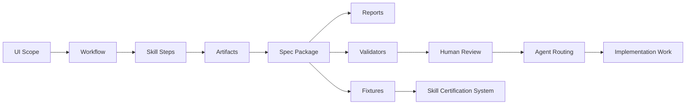
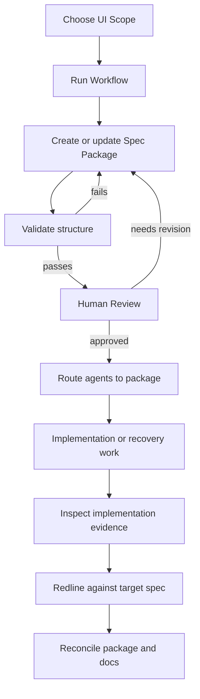

# Interface Skills Architecture

This document explains how Interface Skills turns UI work into explicit, testable Spec Packages for AI-assisted frontend development.

For vocabulary definitions, see `CONTEXT.md`.
For decision rationale, see ADRs in `docs/adr/`.
For concrete package structure, see `templates/spec-package/` and the validators.

## 1. Purpose

Interface Skills exists to prevent UI drift.

When AI-assisted UI work misses the mark, the fix is not to blame the model or the person. The fix is to improve the contract:

- clearer intent
- named visual language
- explicit states
- evidence-based inspection
- testable acceptance
- routed documentation agents can find

The primary contract is the **Spec Package**, not an individual skill.

A skill is useful only if it produces or maintains artifacts that downstream skills, validators, humans, and coding agents can reliably consume.

## 2. System model

The system has these moving parts:



A **UI Scope** is the surface being specified or inspected, such as `/kanban`, app shell navigation, a modal, a route, or a component.

A **Workflow** is an ordered sequence of **Skill Steps** for a common situation.

A **Skill Step** is one invocation of a skill inside a Workflow.

A **Spec Package** is the folder of artifacts for one UI Scope.

## 3. Lifecycle of a UI Scope

A UI Scope usually moves through this lifecycle:



The lifecycle is iterative. A redline or docs-sync report may send work back to earlier artifacts.

The important rule is:

> Scripts enforce structure. Skills provide judgment. Humans approve whether the result is useful and not misleading.

## 4. Workflows and Skill Steps

Interface Skills uses **Workflow** as the official term for an ordered sequence of skill steps.

Do not use “Skill Chain” as formal architecture language.

### Minimum viable workflow

Use for small new UI work.

```text
ui-brief
→ ui-blueprint
→ ui-component-spec
→ ui-acceptance
→ ui-generate-code
→ ui-inspector
→ ui-redline
```

**Starting condition:** The user has a small feature or component idea.

**Exit condition:** There is a testable spec, generated implementation, inspection evidence, and redline report.

### Full documentation-first workflow

Use for new products, unfamiliar domains, or expensive misalignment.

```text
setup-interface-skills
→ ui-brief
→ ui-visual-calibration
→ ui-flow
→ ui-blueprint
→ ui-system
→ ui-screen-spec
→ ui-component-spec
→ ui-microcopy
→ ui-acceptance
→ ui-spec-linter
→ ui-generate-code
→ ui-inspector
→ ui-redline
→ ui-spec-reconcile
→ ui-docs-sync
→ ui-agent-routing
→ ui-to-issues
```

**Starting condition:** The product direction exists, but the UI contract is not explicit enough for implementation.

**Exit condition:** The Spec Package, implementation, repo docs, and agent routing agree.

### Retrospective specification workflow

Use for an existing UI with no prior spec or a UI that has drifted.

```text
setup-interface-skills
→ ui-surface-inventory
→ ui-inspector
→ ui-brief
→ ui-visual-calibration
→ ui-blueprint
→ ui-screen-spec
→ ui-component-spec
→ ui-microcopy
→ ui-acceptance
→ ui-spec-linter
→ ui-redline
→ ui-spec-reconcile
→ ui-docs-sync
→ ui-agent-routing
→ ui-to-issues
```

**Starting condition:** An implementation exists, but the intended UI contract is missing, stale, or scattered.

**Exit condition:** The implementation has been recovered into a Spec Package, inspected, redlined, reconciled, and routed.

## 5. Spec Packages and the Canonical Package Format

A **Spec Package** is any package for one UI Scope.

The **Canonical Package Format** is the current expected structure for new or migrated packages.

A target package usually looks like:

```text
docs/saas-frontend/specs/<scope>/
├── 00-index.md
├── 01-inspector-evidence.md
├── 02-brief.md
├── 03-visual-calibration.md
├── 04-blueprint.md
├── 05-screen-spec.md
├── 06-component-spec-*.md
├── 07-microcopy.md
├── 08-acceptance-checklist.md
├── 09-redlines.md
├── RUN-MANIFEST.md
├── SPEC-LINT-REPORT.md
├── SPEC-RECONCILE-SUMMARY.md
├── DOCS-SYNC-REPORT.md
└── UI-AGENT-ROUTING-SUMMARY.md
```

### Compatibility rule

Older packages may use legacy names such as:

```text
brief.md
blueprint.md
screen-spec.md
acceptance.md
lint-report.md
docs-sync-report.md
agent-routing-report.md
manifest.md
```

Do not casually break legacy examples.

A package with legacy names can still be a valid Spec Package. It is not necessarily in the Canonical Package Format.

Use this distinction:

| Term                     | Meaning                                                         |
| ------------------------ | --------------------------------------------------------------- |
| Spec Package             | Any folder of artifacts for one UI Scope                        |
| Canonical Package Format | Current expected file structure/template                        |
| Legacy Package           | Older package that may need migration or compatibility handling |

`00-index.md` is the package entry point. It should list the package files, active reports, historical reports, open questions, and routing status.

## 6. Reports, Run History, and Run Manifest

A Spec Package can contain reports from different workflow moments.

This creates a stale-report risk: an old lint report, redline, or docs-sync report can remain in the package after fixes land.

The `/kanban` recovery exposed this problem through stale lint/docs-sync reports, symbolic `based_on` references, deprecated files marked current, and generic acceptance automation markers.

To prevent this, separate the concept from the artifact:

| Term         | Meaning                                                          |
| ------------ | ---------------------------------------------------------------- |
| Run History  | The conceptual record of what happened during workflow execution |
| Run Manifest | The file that records Run History for a Spec Package             |

### Run Manifest

Use a separate `RUN-MANIFEST.md` or `run-manifest.json` for detailed history.

`00-index.md` should summarize current state and link to the Run Manifest. It should not become a full event log.

The Run Manifest should record:

| Field                      | Purpose                                                                                     |
| -------------------------- | ------------------------------------------------------------------------------------------- |
| skill step                 | Which skill ran                                                                             |
| run timestamp              | When it ran                                                                                 |
| input artifacts            | What the skill read                                                                         |
| output artifacts           | What the skill produced or updated                                                          |
| source commit / evidence   | What implementation or docs snapshot informed the run                                       |
| report phase               | Whether the output was pre-fix, post-fix, pre-routing, post-routing, current, or historical |
| supersedes / superseded_by | Which reports replace each other                                                            |
| human review status        | Whether a person approved usefulness                                                        |

Example:

```yaml
runs:
  - id: 2026-05-13-ui-redline-001
    skill_step: ui-redline
    phase: pre-fix
    input_artifacts:
      - 01-inspector-evidence.md
      - 08-acceptance-checklist.md
    output_artifacts:
      - 09-redlines.md
    generated_from_commit: abc123
    current_report: false
    superseded_by: 2026-05-13-ui-redline-002
    human_review:
      required: true
      status: approved
      reviewer:
      review_date:
```

### Report lifecycle metadata

Every Report should include lifecycle metadata.

Minimum frontmatter:

```yaml
spec_type: report
report_type: redline | lint | reconcile | docs-sync | agent-routing
report_phase: pre-fix | post-fix | pre-routing | post-routing | current | historical
current_report: true
supersedes: []
superseded_by:
generated_from_commit:
status: draft | current | approved | complete
```

Reports that supersede earlier reports must name what they supersede.

Reports that are superseded must name the replacement.

### Active and historical reports in `00-index.md`

Each package index should include:

```md
## Active reports

| Report type | Active file | Phase | Generated from |
|---|---|---|---|
| Redline | `09-redlines.md` | post-fix | `<commit>` |

## Historical reports

| File | Status | Superseded by |
|---|---|---|
| `SPEC-LINT-REPORT.md` | historical | `SPEC-LINT-REPORT-2026-05-13.md` |
```

## 7. Fixtures and promotion evidence

Fixtures are frozen test cases used to validate draft skills.

Fixtures are not live product documentation.

Product repositories such as `ViralFactory` or `metamorfose-edutech` contain live product specs. The `interface-skills/examples/` directory contains copied or snapshotted examples for testing the skill system.

A fixture should usually include:

```text
examples/<fixture-name>/
├── fixture.yaml
├── input/
├── reports/
├── expected/
│   └── rubric.md
├── notes.md
└── source-docs/
```

`notes.md` should record Human Review:

```md
## Human review

- Machine validation: pass | fail
- Human review required: yes
- Human status: pending | approved | rejected | needs_revision
- Reviewer:
- Review date:
- Notes:
```

### Known fixture candidates

| Case        | Why it matters                                                       |
| ----------- | -------------------------------------------------------------------- |
| `/create`   | Complete retrospective recovery package and full workflow fixture    |
| `/kanban`   | Best example for report lifecycle and stale report confusion         |
| `admin-nav` | Best example for app-shell/navigation-map scope and monorepo routing |

Fixture lifecycle:

```text
capture → freeze → validate → human review → promotion evidence
```

## 8. Validators and Human Review

Validators and Human Review have different jobs.

| Mechanism    | Owns                                                  | Does not own                               |
| ------------ | ----------------------------------------------------- | ------------------------------------------ |
| Validator    | Structure, metadata, references, deterministic checks | Usefulness, product judgment, design taste |
| Human Review | Usefulness, intent alignment, misleadingness          | Mechanical enforcement                     |

Examples of deterministic checks:

* `based_on` references resolve to real filenames
* files in `.deprecated/` are not marked `status: current`
* generic `[A]` acceptance markers are not used
* automation labels specify a mechanism such as `[A:static]`, `[A:lint]`, `[A:playwright]`, `[A:axe]`, or `[A:unit]`
* only one current report exists per report type
* every current report appears in the Active Reports table
* superseded reports point to their replacement

Validators should live as deterministic scripts where possible.

Model-driven skills can recommend fixes, but they should not be the only authority for structure.

Detailed architecture and criteria belong in [SKILL-CERTIFICATION-SYSTEM.md](docs/promotion/SKILL-CERTIFICATION-SYSTEM.md).

## 10. Agent Routing

Agent Routing makes Spec Packages discoverable to future AI agents.

A routed repo should point agents toward:

* `INTERFACE_SKILLS.md`
* the specs root, such as `docs/saas-frontend/specs/`
* the relevant package index, usually `00-index.md`
* required agent entry points such as:

  * `CLAUDE.md`
  * `AGENTS.md`
  * `GEMINI.md`
  * `.cursor/rules`
  * `.github/copilot-instructions.md`

Routing should be precise but not duplicative.

Agent files should tell agents where to look. The Spec Package should contain the actual UI contract.

## 11. Boundaries

This document explains how the system fits together.

It does not own every detail.

| Concern                              | Owner                     |
| ------------------------------------ | ------------------------- |
| Vocabulary and naming guardrails     | `CONTEXT.md`              |
| Decision rationale and tradeoffs     | ADRs                      |
| Concrete package structure           | `templates/spec-package/` |
| Deterministic checks                 | Validators                |
| Skill-by-skill operational reference | `docs/skill-reference.md` |
| Detailed promotion rubric            | `docs/skill-promotion.md` |
| Live product specs                   | Product repositories      |

## 12. Open questions

These questions should not block this document, but they should become follow-up issues or ADRs:

1. Should the Run Manifest be Markdown, JSON, or both?
2. Which validators become mandatory before a skill can be promoted?
3. Should `ui-orchestrator` read Run Manifest in v1 or v2?
4. How should legacy packages be migrated without breaking examples?
5. Should report lifecycle metadata be enforced by a validator immediately or introduced gradually?
