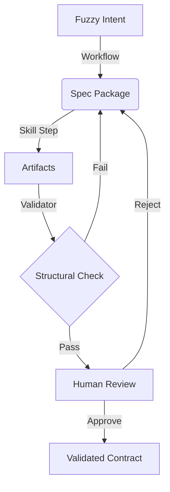

# Interface Skills Architecture

This document explains the system lifecycle, the interaction between components, and the promotion pipeline. For vocabulary definitions, see `CONTEXT.md`.

## Terminology Decisions
To maintain architectural precision, we use:
- **Workflow**, not "skill chain."
- **Run History** (concept) vs. **Run Manifest** (artifact).
- **Spec Package** (folder) vs. **Canonical Package Format** (structure).
- **Skill Step** to describe a single invocation within a workflow.

## 1. The Spec Lifecycle
The system moves from "Fuzzy Intent" to "Validated Contract" through the interaction of Skills and Spec Packages.



## 2. Workflows and Skill Steps
A **Workflow** (e.g., `Spec Recovery`) is a sequence of **Skill Steps**. 
- Each step consumes one or more existing artifacts.
- Each step produces or updates artifacts within the **Spec Package**.
- The lineage of these steps is recorded in the **Run Manifest**.

### The Run Manifest Format
The Run Manifest is stored in the Canonical Package Format (e.g., as part of `00-index.md` or a separate `run-manifest.json`).

**Example Manifest:**
```json
{
  "skill_name": "ui-brief",
  "timestamp": "2026-05-13T09:00:00Z",
  "input_hashes": {
    "examples/kanban/screenshot.png": "e3b0c44298fc1c149afbf4c8996fb92427ae41e4649b934ca495991b7852b855"
  },
  "artifact_outputs": [
    "02-brief.md"
  ]
}
```

## 3. The Promotion Pipeline
Skills move from **Draft** to **Stable** based on empirical evidence provided by **Fixtures**.

1. **Frozen Fixture**: A real-world Spec Package is copied into the repo as a "frozen" test case.
2. **Execution**: The Draft Skill is run against the fixture inputs.
3. **Validation**: A **Validator** ensures the output matches the **Canonical Package Format**.
4. **Promotion**: Once multiple fixtures pass both structural validation and human review, the skill is promoted to Stable.

## 4. Documentation Boundaries
- **`CONTEXT.md`**: The Dictionary. Use this to settle naming disputes.
- **`ADRs`**: The Decision Log. Use this to understand the *Why* behind the system.
- **`docs/architecture.md`**: The Circuit Diagram (this file). Use this to understand the *How*.
