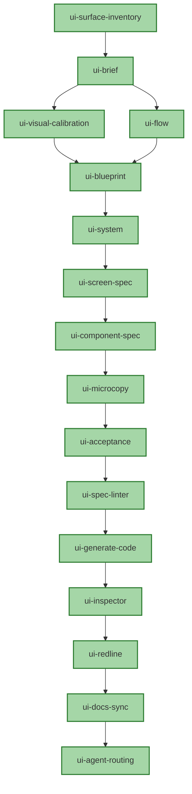

# Roadmap: Skill and Workflow Promotion Plan

This roadmap tracks the active queue, phased progress, and sequential waves required to promote all remaining draft skills to **stable** and certify all orchestration workflows to **full-chain stable**.

---

## 1. Phase Progress

| Phase | Description | Focus Areas | Status |
| :--- | :--- | :--- | :--- |
| **Phase 1** | **Validator Ecosystem Extraction** | Decomposing monolithic logic into isolated, contract-based Python validators. | **100% Complete** |
| **Phase 2** | **Workflow Stability Generalization** | Implementing workflow-level validators, [Zero-Manual-Repair](file:///h:/GithubRepositories/interface-skills/scripts/validators/zero_repair.py) criteria, and multi-skill chain execution. | **100% Complete** |
| **Phase 3** | **Hardening & Governance Gating** | Formalizing CI/CD gates, registry promotion locks, and reference evidence synchronization. | **100% Complete** |

---

## 2. Dependency-Driven Promotion Waves

To prevent authority dilution and verify semantic continuity, we promote draft skills in sequential, dependency-driven waves.

### Wave 1: Core Specification Chain
Focuses on locking in the static, upstream spec-generation skills.
- [x] Promote **`ui-visual-calibration`** to `stable`
  - *Prerequisites*: Approved structural promotion plan with calibrated failure modes; human-reviewed gold standard execution.
- [x] Promote **`ui-screen-spec`** to `stable`
  - *Prerequisites*: Enforce regional layout mappings and state-dependency rubrics.

### Wave 2: Implementation & Inspection Chain
Focuses on downstream code generation and feedback loop auditing.
- [x] Promote **`ui-inspector`** to `stable`
  - *Prerequisites*: Integrate robust computed-style extracting and DOM validation schemas.
- [x] Promote **`ui-spec-reconcile`** to `stable`
  - *Prerequisites*: Enforce strict round-trip continuity checking between implementation and spec files.
- [x] Promote **`ui-storybook-docs`** to `stable`
  - *Prerequisites*: Establish MDX template check criteria and Storybook catalog matching.

### Wave 3: Full-Chain Workflow Certifications
Certifying multi-skill chains using real handoff evidence and zero-manual-repair gates.
- [x] Certify **Core Spec Workflow** (Brief -> Calibration -> Blueprint -> System -> Component)
- [x] Certify **Audit & Refactor Workflow** (Inspector -> Redline -> Reconcile -> Docs-Sync)
- [x] Certify **Full Agent-Routing Workflow** (Sync -> Agent-Routing)

---

## 3. Active Task Checklist

### Testing & Infrastructure Hardening
- [x] Fix path contamination in [test_certification_authority.py](file:///h:/GithubRepositories/interface-skills/scripts/test_certification_authority.py) by specifying `cwd` for subprocesses.
- [x] Enhance [validate-package.py](file:///h:/GithubRepositories/interface-skills/scripts/validate-package.py) to validate `run-manifest.json` schemas and check for missing artifacts.
- [x] Ensure 100% success across the 68 tests of the global validator verification suite.
- [x] Enforce dynamic fixture lookup in [sync_reference_evidence.py](file:///h:/GithubRepositories/interface-skills/scripts/sync_reference_evidence.py) to support divergent fixture/skill naming.

### Certification Accomplishments
- [x] Run the promotion suite for `ui-screen-spec`, `ui-inspector`, `ui-spec-reconcile`, and `ui-storybook-docs` with exit code `0`.
- [x] Approve and sign off on all 6 human reviews.
- [x] Execute workflow-level certified runs for `spec-recovery` and `spec-recovery-negative-missing-handoff`.
- [x] Verify global certification compliance: `verify_certification_authority.py` returns SUCCESS.
